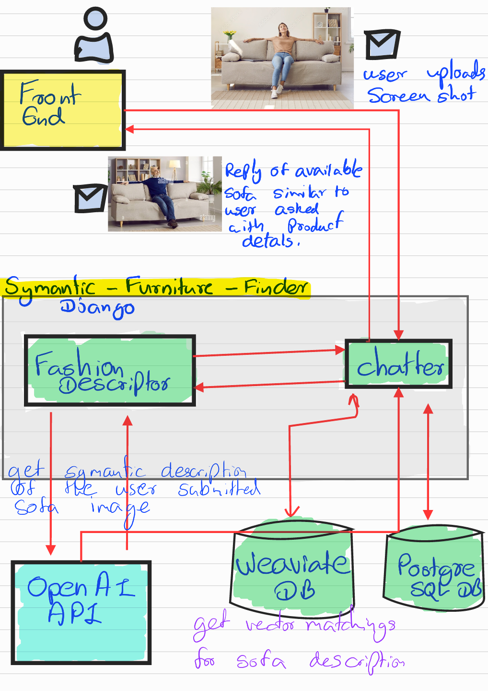

# 🛋️ Semantic Furniture Finder

## 📘 Project Overview
**Semantic Furniture Finder** is an AI-powered system designed to help customers find available furniture products by submitting an image or screenshot through a chatbot interface.  
Instead of relying on **visual image similarity**, this project uses **semantic understanding** of furniture images to identify similar items — even if colors, models, or backgrounds differ.

---

## 🎯 Scenario
ABC Furniture Company wants to implement a chatbot system on their website that enables customers to:
- Upload a screenshot or photo of furniture (e.g., a sofa).
- Receive suggestions of similar available furniture from the company’s catalog, along with product details.

---

## 🤔 Why Visual Image Matching Fails
Traditional image-matching approaches are often unreliable because:
- Users may upload images containing **different models**, **colors**, or **backgrounds**.
- Extra, **irrelevant objects** in photos can confuse visual models.
- Exact pixel-level matching isn’t effective for **semantic similarity**.

---

## 💡 Our Solution
To overcome these challenges, the system uses **semantic similarity** instead of visual similarity.  
By converting images into **semantic vectors** and comparing their meanings (not just their visuals), we achieve more accurate furniture recommendations.

---

## 🧠 System Architecture

### Components:
- **Front End:**  
  The user uploads a furniture image or screenshot via the chatbot interface.

- **Semantic Furniture Finder (Django):**  
  Backend service managing all communication between the frontend, databases, and AI models.

- **Fashion Descriptor:**  
  Extracts semantic descriptions from the user-submitted image.

- **OpenAI API:**  
  Generates text-based semantic embeddings from the image input.

- **Weaviate DB:**  
  Vector database used to store embeddings and perform **semantic vector matching** to find similar items.

- **PostgreSQL DB:**  
  Stores product metadata and details for each item.

- **Chatbot:**  
  Interacts with the user, providing product recommendations and descriptions based on semantic similarity.

---

## 📜 Project Explanation

---

## ⚙️ Tech Stack

| Component | Technology |
|------------|-------------|
| Backend | Django |
| AI API | OpenAI API |
| Vector Database | Weaviate |
| Relational Database | PostgreSQL |
| Frontend | Web (Chatbot Interface) |
| Language | Python |

---

## 🚀 Workflow Summary

1. **User uploads** an image of furniture to the chatbot.
2. **Fashion Descriptor** extracts a semantic description from the image.
3. **OpenAI API** generates embeddings (vector representation) of that description.
4. **Weaviate DB** searches for semantically similar furniture items in the company’s catalog.
5. **PostgreSQL DB** provides product details for the matched items.
6. **Chatbot** sends the top-matched results to the user with product information.

---

## 🧩 Key Benefits
- Works even when user images have different angles, lighting, or colors.
- Provides meaningful matches through **semantic understanding**.
- Easily scalable with new furniture data.
- Integrates seamlessly with web-based chatbot systems.

---

## 📌 Future Enhancements
- Add **voice-based queries** to improve user interaction.
- Integrate **multimodal embeddings** (image + text) for better semantic precision.
- Implement **real-time product availability** updates.

---

## 🏁 Conclusion
The **Semantic Furniture Finder** provides a smarter, AI-driven way for furniture retailers to help customers discover products that truly match their intent — not just their visuals.

---

> **Author:** Deshitha Hansajith Senarath  
> **Date:** November 2025  
> **Version:** 1.0

